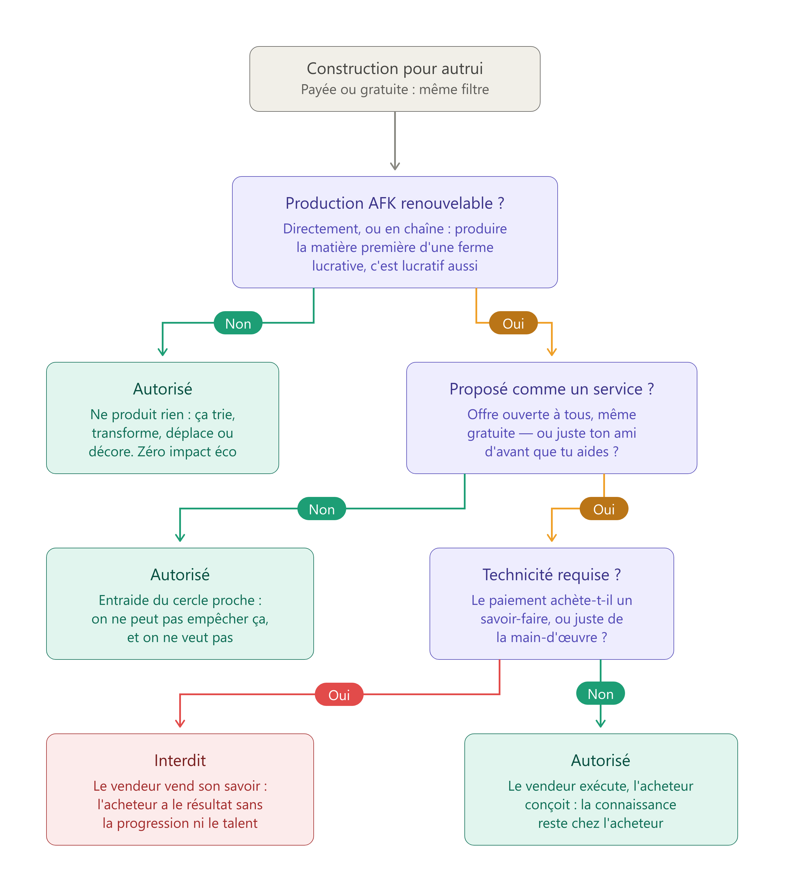

# 🧪 Règlement Général v2 (proposition)


**Page temporaire.** Cette version est une proposition de refonte, à comparer au [Règlement Général](reglement.md) actuel, qui seul fait foi tant qu'elle n'est pas adoptée. Les changements sont listés en bas de page.


<h2 align="center"><mark style="color:yellow;">⚡ L'essentiel en 10 réflexes</mark></h2>

1. **Respecte tout le monde** : aucun contenu haineux, sexuel, discriminatoire ou menaçant.
2. **Parle français**, sans spam ni querelle publique.
3. **Un seul compte** par joueur.
4. **Aucune publicité** pour d'autres serveurs.
5. **Aucune triche** : ni mod avantageux, ni autoclick, ni exploitation de bug.
6. **Aucun PvP**, même indirect.
7. **Ne touche pas** aux constructions et aux biens des autres.
8. **Rien ne se vend** contre de l'argent réel.
9. **Fermes** : accès sur autorisation du propriétaire, et l'on ne vend pas son savoir-faire de construction.
10. **L'esprit du règlement prime sur sa lettre** : le contourner est une infraction.

En cas de doute, demande à la modération. En cas de litige, ouvre un ticket sur le [Discord](https://discord.gg/qqBCWgpRDc).

<h2 align="center"><mark style="color:yellow;">📖 Définitions</mark></h2>

Dans tout le règlement, ces termes ont le sens défini ici :

| Terme | Définition |
| --- | --- |
| **Ferme** | Construction conçue pour produire une ressource de manière répétable, en réduisant au maximum l'intervention du joueur. |
| **Ferme lucrative** | Ferme dont la production peut être vendue à l'AdminShop, directement ou en chaîne : produire la matière première d'une ferme lucrative est lucratif aussi. |
| **Cercle proche** | Personnes avec lesquelles tu entretiens une relation préexistante. Une relation nouée pour l'occasion (par exemple pour obtenir une construction) n'en fait pas partie. |
| **PW (warp joueur)** | Point de téléportation public créé par un joueur. |
| **Design technique public** | Plan de construction librement accessible (tutoriels, vidéos...), qu'aucun joueur ne peut revendiquer comme sa création. |

<h2 align="center"><mark style="color:yellow;">0. Principes généraux</mark></h2>

* **Tu acceptes ce règlement en te connectant** à l'une des plateformes de Dynastia. L'<mark style="color:red;">Administration</mark> peut le modifier à tout moment et, propriétaire du serveur, exclure un utilisateur sans fournir de raison. Un compte utilisé pour contourner une sanction s'expose à la même sanction. _(Art.0-1)_
* **Une sanction est proportionnée** aux faits et aux antécédents du joueur. Le modérateur peut l'expliquer sur demande, sans obligation de preuve. _(Art.0-2)_
* **Tu peux contester une sanction** via un ticket sur le [Discord](https://discord.gg/qqBCWgpRDc). _(Art.0-3)_
* **La modération répond à tes questions** sur toutes nos plateformes ; les autres membres du staff n'y sont pas tenus. _(Art.0-4)_
* **Tous les joueurs sont égaux**, quel que soit leur grade. _(Art.0-5)_
* **Un problème avec la modération ?** Réfère-toi à l'administration en dernier recours. L'équipe est bénévole, merci d'en tenir compte. _(Art.0-6)_

<h2 align="center"><mark style="color:yellow;">1. Sécurité et partage des comptes</mark></h2>

* **Ton compte est sous ton entière responsabilité**, sécurité comprise : nous ne couvrons pas les piratages. _(Art.1-1)_
* **Les infractions de ton compte te suivent**, même commises par un tiers : ne communique jamais tes identifiants. _(Art.1-2)_
* **Utiliser plusieurs comptes** sur le serveur est <mark style="color:red;">**interdit**</mark>, connectés simultanément ou non. _(Art.1-3)_
* **Jouer avec un proche du même foyer** est <mark style="color:green;">**autorisé**</mark> à condition de prévenir la modération en amont. _(Art.1-4)_
* **Un compte banni le reste**, même si l'infraction vient d'un proche. _(Art.1-5)_

<h2 align="center"><mark style="color:yellow;">2. Publicité</mark></h2>

* **Promouvoir un autre serveur Minecraft** est <mark style="color:red;">**interdit**</mark>, sur toutes nos plateformes et sous toute forme (lien, IP, nom, image...). _(Art.2-1)_
* **Les annonces relatives à Dynastia** (événements de joueurs, recrutements d'équipe...) sont <mark style="color:green;">**autorisées**</mark>. _(Art.2-2)_

<h2 align="center"><mark style="color:yellow;">3. Communication</mark></h2>

* **La langue du serveur est le français.** Écris de manière compréhensible. _(Art.3-1)_
* **Tout contenu portant atteinte à autrui ou inadapté à un public jeune** est <mark style="color:red;">**interdit**</mark> : sexuel, discriminatoire, haineux, violent, injurieux, notamment. La liste est illustrative : c'est le caractère du contenu qui constitue l'infraction. _(Art.3-2)_
* **Les débats politiques et les querelles personnelles** sur les canaux publics sont <mark style="color:red;">**interdits**</mark>. Un désaccord ordinaire (négociation, débat de jeu...) n'est pas concerné tant qu'il reste courtois. _(Art.3-3)_
* **Menacer une personne** (DDoS, incitation au suicide...) est <mark style="color:red;">**interdit**</mark>. _(Art.3-4)_
* **Le spam et le flood** sont <mark style="color:red;">**interdits**</mark> : tout message dont le seul effet est de gêner les autres. _(Art.3-5)_
* **Les majuscules abusives** rendant le chat illisible comptent comme du spam. _(Art.3-6)_
* **La publicité pour un PW** est limitée à un message par heure ; au-delà, elle compte comme du spam. _(Art.3-7)_
* **Le staff se respecte comme tout autre joueur.** Ses membres jouent avec toi, sans permission supplémentaire sur le gameplay. _(Art.3-8)_
* **Divulguer une conversation privée** sans l'accord de tous ses participants est <mark style="color:red;">**interdit**</mark>, tout comme publier des informations privées. _(Art.3-9)_
* **Tu es seul responsable de ce que tu publies.** _(Art.3-10)_

<h2 align="center"><mark style="color:yellow;">4. Usurpation d'identité</mark></h2>

* **Se faire passer pour un autre**, joueur ou, a fortiori, membre du staff, par pseudonyme, avatar ou comportement, est <mark style="color:red;">**interdit**</mark>. Sanction sévère. _(Art.4-1)_

<h2 align="center"><mark style="color:yellow;">5. Skins, capes, pseudonymes et constructions</mark></h2>

* **Skins, capes et pseudonymes suivent les critères de contenu des messages** (Art.3-2). Un compte en infraction est banni jusqu'au changement de l'élément concerné ; le débannissement se réclame une fois ce changement effectué. _(Art.5-1)_
* **Les constructions aussi.** Une construction en infraction fait l'objet d'une demande de modification sous délai ; à défaut, destruction par l'équipe et sanction. _(Art.5-2)_

<h2 align="center"><mark style="color:yellow;">6. Utilisation et modification du client</mark></h2>

* **Toute modification du client procurant un avantage sur les autres joueurs** est <mark style="color:red;">**interdite**</mark>. Ce critère fait foi pour tout mod, y compris hors liste ; en cas de doute, demande à la modération avant utilisation. _(Art.6-1)_
* **L'autoclick**, et tout autre moyen de cliquer sans action manuelle, est <mark style="color:red;">**interdit**</mark>. _(Art.6-2)_

Sont notamment <mark style="color:green;">**autorisés**</mark> :

* les mods de carte, **sans visibilité sur les sous-sols et les minerais** ;
* Litematica, **aide visuelle uniquement** ;
* les mods d'inventaire **non automatisés** ;
* les mods purement visuels ou d'optimisation (Optifine, Sodium...), **sans avantage de vision souterraine ou dans la lave**.

<h2 align="center"><mark style="color:yellow;">7. Exploitation de bug et abus du système</mark></h2>

* **Exploiter volontairement un bug** est <mark style="color:red;">**interdit**</mark>. Signale tout bug rencontré via un ticket sur le [Discord](https://discord.gg/qqBCWgpRDc). _(Art.7-1)_
* **Contourner les limites de vente de l'AdminShop** est <mark style="color:red;">**interdit**</mark>, notamment par échanges intermédiaires (ex. : échanger un shulker de citrouilles contre du bambou pour vendre au-delà de la limite). Dans toute vente entre joueurs, HDV compris, tes prix doivent être supérieurs au prix auquel l'AdminShop **achète** la ressource. _(Art.7-2)_

<h2 align="center"><mark style="color:yellow;">11. Achats et boutique</mark></h2>

* **La boutique** propose grades, objets, clés et monnaies. Les achats contribuent au maintien du serveur ; ils ne sont jamais obligatoires. _(Art.11-1)_
* **Les achats en boutique sont définitifs** : aucun remboursement. _(Art.11-2)_
* **Les pertes en jeu** ne sont compensées qu'en cas de bug imputable au serveur, via ticket. _(Art.11-3)_
* **La protection de tes biens t'incombe** dans tous les autres cas. _(Art.11-4)_
* **Erreur de pseudonyme lors d'un achat ?** L'administration restaure l'achat sur le bon pseudonyme, contre preuve d'achat de moins de 48 heures. _(Art.11-5)_
* **Mineur ?** L'autorisation de ton tuteur légal est requise avant tout achat ; Dynastia n'est pas responsable des achats faits sans elle. _(Art.11-6)_
* **Vendre contre de la monnaie réelle** est <mark style="color:red;">**interdit**</mark>, qu'il s'agisse d'objets, de services ou de tâches sur Dynastia. Les cadeaux restent possibles, leur revente non. Les articles de la boutique ne se vendent que sur la boutique officielle. _(Art.11-7)_
* **Transférer les données d'un compte** (objets, monnaies, grades, progression...) vers le compte d'un autre joueur, ou par tes propres moyens entre deux comptes, est <mark style="color:red;">**interdit**</mark> : elles sont liées à leur propriétaire. _(Art.11-8)_
* **Changement de pseudonyme** : le serveur conserve tout automatiquement, sauf les dollars ($), transférés par l'administration via un ticket précisant l'ancien et le nouveau pseudonyme. _(Art.11-9)_
* **Compte perdu** : l'administration peut migrer vers ton nouveau compte, sur ticket, uniquement les éléments ci-dessous. Tout le reste est définitivement perdu. _(Art.11-10)_

| ✅ Transféré | ❌ Perdu |
| --- | --- |
| Inventaire et Ender Chest | Progression du prestige en cours |
| Dollars ($) | Crédits |
| Claims et les shops qu'ils contiennent | Votes et récompenses en attente |
| Prestige et rang VIP (sans la progression) | Tout élément hors de la colonne « Transféré » |
| Warps joueur | |

<h2 align="center"><mark style="color:yellow;">13. Vols et griefs</mark></h2>

* **Détruire ou dégrader la construction d'un autre joueur** est <mark style="color:red;">**interdit**</mark>, protégée ou non. Reconstruire peut atténuer la sanction, jamais l'annuler. _(Art.13-1)_ Dynastia enregistre les actions : les fautifs sont identifiés sans aucun doute possible.
* **Garder un objet perdu, jeté ou posé par un autre joueur** est <mark style="color:red;">**interdit**</mark> : si son propriétaire est connu, rends-le. _(Art.13-2)_
* **Voler, revendre ou s'approprier la création d'un autre joueur** est <mark style="color:red;">**interdit**</mark>. _(Art.13-3)_
* **Copier, reproduire ou revendre une création originale** (build, map-art...) sans l'accord préalable de son auteur est <mark style="color:red;">**interdit**</mark> ; garde une preuve de l'accord. Les designs techniques publics (fermes, trieurs, systèmes issus de tutoriels) ne sont la création de personne : les reproduire est libre. _(Art.13-4)_
* **Contribuer au combat ou récolter les gains de l'EnderDragon d'un autre joueur** sans son accord est <mark style="color:red;">**interdit**</mark> sur l'île principale de l'End. Attends la fin de sa session pour prendre sa place. _(Art.13-5)_

<h2 align="center"><mark style="color:yellow;">14. Player versus Player</mark></h2>

* **Toute forme de PvP** est <mark style="color:red;">**interdite**</mark>, y compris tout moyen indirect d'infliger des dégâts (monstres, lave ou toute autre chose). _(Art.14)_

<h2 align="center"><mark style="color:yellow;">15. Fermes, warps et résidences</mark></h2>

* **L'accès à une ferme** est réservé par défaut à ses contributeurs et au cercle proche de son propriétaire. _(Art.15-1)_
* **Utiliser une ferme sans l'autorisation explicite et gratuite de son propriétaire** est <mark style="color:red;">**interdit**</mark> ; cette autorisation peut élargir le cercle par défaut. _(Art.15-2)_
* **Construire une ferme ou un système pour un autre joueur** suit le schéma ci-dessous. Gratuit ou payé : même filtre. _(Art.15-3)_

<figure><figcaption></figcaption></figure>

En résumé :

* <mark style="color:green;">**Autorisé**</mark> : toute construction qui ne produit aucune ressource (trieur, porte à pistons, éclairage, mini-jeu, décoration...), payante ou non. Zéro impact sur l'économie.
* <mark style="color:red;">**Interdit**</mark> : une ferme lucrative proposée comme un service (offre ouverte à tous) et demandant une réelle technicité. On ne vend pas un savoir-faire, cela priverait l'acheteur de sa progression.
* <mark style="color:green;">**Autorisé**</mark> : l'entraide au sein du cercle proche, et la simple main-d'œuvre quand c'est l'acheteur qui conçoit et le vendeur qui exécute. Le savoir reste chez l'acheteur.

Suite de la section :

* **L'**<mark style="color:red;">**Administration**</mark>** peut détruire une ferme** qui nuit à l'expérience de jeu des autres, si son propriétaire refuse les modifications demandées. _(Art.15-4)_
* **Louer une ferme ou vendre son accès** est <mark style="color:red;">**interdit**</mark>. _(Art.15-5)_
* **Définir un warp joueur dans une ferme** est <mark style="color:red;">**interdit**</mark> : suppression et sanction. _(Art.15-6)_
* **Une distance de 10 chunks minimum** doit séparer une ferme des limites d'un PW, pour qu'elle ne soit pas chargée par les visiteurs ; exception possible pour les fermes non lucratives de taille modeste, à l'appréciation de la modération. _(Art.15-7)_
* **Utiliser un PW pour augmenter ses points de résidences** est <mark style="color:red;">**interdit**</mark> : un warp doit être un point d'intérêt pour tous. _(Art.15-8)_
* **Les PW trop proches les uns des autres** seront supprimés pour ne pas encombrer le menu. _(Art.15-9)_
* **Définir une résidence dans ou près de la construction d'un autre joueur** sans son accord écrit préalable est <mark style="color:red;">**interdit**</mark>. Garde une preuve de cet accord. _(Art.15-10)_

<h2 align="center"><mark style="color:yellow;">16. Têtes décoratives et objets légendaires</mark></h2>

* **Le don de têtes décoratives (/hdb) ne doit pas se substituer à l'achat de la commande** : le commerce et les dons répétés vers un joueur n'y ayant pas accès sont <mark style="color:red;">**interdits**</mark> ; le don occasionnel, notamment à une équipe t'aidant sur une construction, est <mark style="color:green;">**toléré**</mark>. La modération apprécie au cas par cas selon ce principe. _(Art.16-1)_
* **Louer un objet légendaire** (caisse légendaire) est <mark style="color:red;">**interdit**</mark> ; le vendre est <mark style="color:green;">**autorisé**</mark>. _(Art.16-2)_
* **Le propriétaire d'un objet légendaire reste seul responsable** de sa casse ou de sa perte, même prêté gratuitement. _(Art.16-3)_

<mark style="color:red;">**► Contourner l'esprit du règlement, par quelque moyen que ce soit, est strictement interdit. (Art.17)**</mark>

***

## Notes de version (à retirer si adoption)

La numérotation reprend celle du règlement actuel : un article inchangé garde son numéro, un numéro supprimé n'est jamais réutilisé, une nouvelle règle prend le numéro libre suivant de sa section. Les sections 8 à 10 et 12, jamais utilisées, restent réservées.

| Article | Changement |
| --- | --- |
| Ton | Passage du vouvoiement au tutoiement, sur l'ensemble du règlement |
| Format | Une norme par puce, en forme verdict-terminale : le mot verdict est coloré (rouge interdit, vert autorisé/toléré) ; les puces sans couleur décrivent le fonctionnement et les procédures |
| 0-1 | « durement réprimandée » retiré : contredisait la proportionnalité du 0-2 |
| 0-3 | « Vous vous réservez le droit » corrigé en « Tu peux » |
| 1-4, 1-5 | Nouveaux numéros : l'ancien texte avait deux Art.1-3 et une règle non numérotée (foyer) ; le 1-4 devient une permission conditionnelle |
| 3-1 | La langue (le français) est enfin écrite |
| 3-2 | Liste d'adjectifs remplacée par un principe, la liste devient illustrative |
| 3-3 | Statut clarifié (interdiction) et périmètre borné (les désaccords courtois ne sont pas des « conflits ») |
| 5-1, 5-2 | Sanction rendue applicable : un banni ne pouvait pas modifier sa construction ; le 5-2 reprend la mécanique du 15-4 |
| 6-1 | Le principe tranche pour les mods hors liste : la zone « à vos risques et périls » disparaît |
| 6-3 | Abrogé : doublon de l'Art.0-3 (réclamation contre un modérateur), mal rangé dans la section client |
| 7-2 | « Prix du shop admin » précisé : prix d'**achat** de l'AdminShop ; le HDV est explicitement inclus |
| 11-7 | « plausible » corrigé |
| 11-8, 11-9 | Réécrits : l'ancien 11-8 interdisait littéralement tout échange d'objets entre joueurs |
| 11-10 | Nouveau : migration en cas de compte perdu (liste fermée des éléments transférables) |
| 13-1 | « sans reconstruire » supprimé : la reconstruction devient une atténuante, plus une exonération |
| 13-2 | Reformulé en interdiction (garder l'objet) plutôt qu'en obligation, pour un verdict unique |
| 13-4 | Périmètre précisé : créations originales protégées, designs techniques publics explicitement libres |
| 15-1, 15-2 | Une norme chacun : le 15-1 pose le régime par défaut, le 15-2 devient une interdiction unique dont l'autorisation du propriétaire définit le périmètre ; « validation » supprimé |
| 15-3 | Prose remplacée par le schéma décisionnel et son résumé |
| 15-5 | La vente d'accès est explicitement incluse dans l'interdiction de location |
| 15-7 | L'exception « petites fermes » est adossée à la définition de ferme lucrative ; article séparé du 15-6 |
| 16-1 | Fusion du 16-1 et du 16-1' autour du principe de non-substitution à l'achat |
| 17 | « via des sous-entendus (etc.) » remplacé par « l'esprit du règlement, par quelque moyen que ce soit » |
| Définitions, Essentiel | Nouvelles sections : lexique en tableau et résumé en 10 points |
