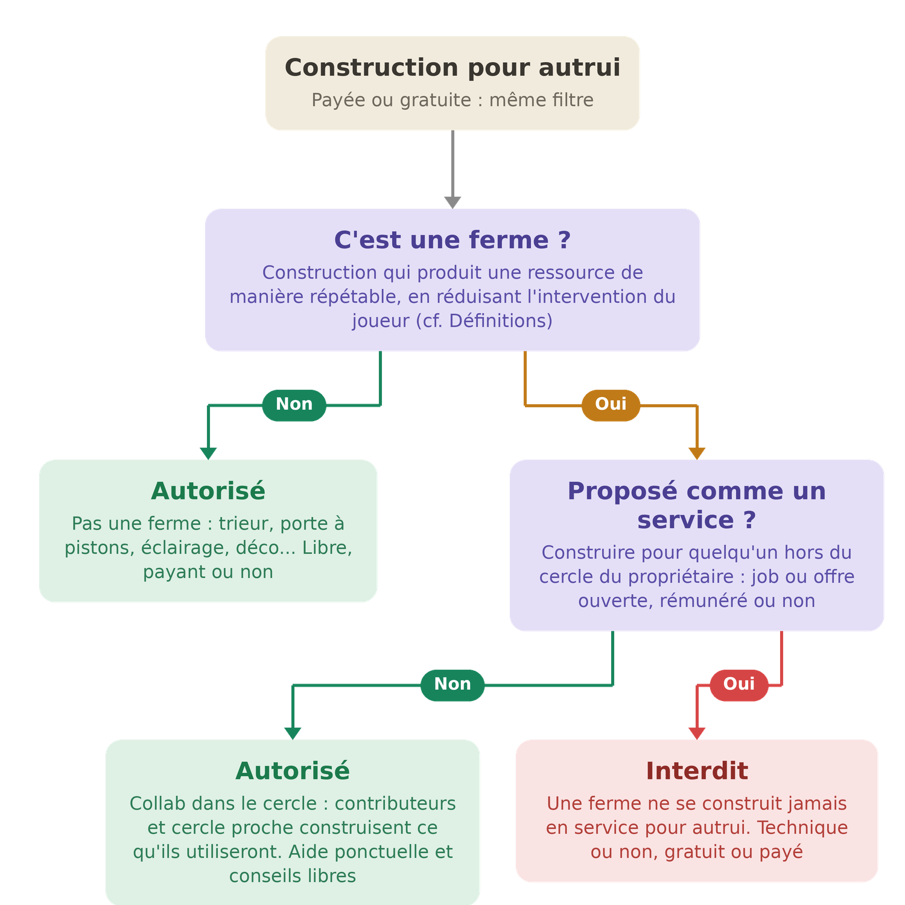

# ⚖️ Règlement Général v4 (proposition)


**Page temporaire.** Troisième itération de la refonte : le contenu et la numérotation sont ceux de la [v3](reglement-trois.md), convertis aux conventions légistiques (registre impersonnel, indicatif présent, terminologie unifiée). Seul le [Règlement Général](reglement.md) actuel fait foi. Les numéros R1 à R54 sont strictement identiques entre v3 et v4.


En cas de doute, la modération répond à toute question. En cas de litige, un ticket sur le [Discord](https://discord.gg/qqBCWgpRDc).

<h2 align="center"><mark style="color:yellow;">📖 Définitions</mark></h2>

Dans tout le règlement, ces termes ont le sens défini ici :

| Terme | Définition |
| --- | --- |
| **Ferme** | Construction conçue pour produire une ressource de manière répétable, en réduisant au maximum l'intervention du joueur. |
| **Cercle proche** | Personnes avec lesquelles un joueur entretient une relation préexistante. Une relation nouée pour l'occasion (par exemple pour obtenir une construction) n'en fait pas partie. La modération l'apprécie sur des éléments antérieurs à la situation examinée : ancienneté des interactions, claims ou projets partagés, historique commun. |
| **Contributeur** | Joueur ayant réellement participé à la construction d'une ferme. Une participation symbolique ou arrangée pour l'occasion ne crée pas ce statut ; il s'apprécie sur les mêmes éléments antérieurs que le cercle proche. |
| **PW (warp joueur)** | Point de téléportation public créé par un joueur. |
| **Design technique public** | Plan de construction librement accessible (tutoriels, vidéos...), qu'aucun joueur ne peut revendiquer comme sa création. |
| **Équipe** | L'ensemble des membres au service du serveur : modération, développement, Administration. |
| **Modération** | La partie de l'équipe chargée de faire appliquer le présent règlement. |
| **Administration** | La direction du serveur, propriétaire de la plateforme. |

<h2 align="center"><mark style="color:yellow;">1. Principes généraux</mark></h2>

* **R1** · **La connexion à l'une des plateformes de Dynastia vaut acceptation du présent règlement.** L'<mark style="color:red;">Administration</mark> peut le modifier à tout moment. Un compte utilisé pour contourner une sanction s'expose à la même sanction.
* **R2** · **Le règlement s'applique sur toutes les plateformes de Dynastia** : serveur de jeu, Discord et tout autre canal officiel. Les règles qui n'ont de sens qu'en jeu (triche, PvP, biens, fermes, warps) ne concernent que le serveur.
* **R3** · **Toute sanction est proportionnée** aux faits et aux antécédents du joueur, et ne vise que des faits interdits au moment où ils ont été commis. Le modérateur qui l'applique peut l'expliquer sur demande, sans obligation de divulguer les méthodes de détection.
* **R4** · **Toute sanction peut être contestée** via un ticket sur le [Discord](https://discord.gg/qqBCWgpRDc) : la contestation est examinée par la modération, au besoin collégialement ou par l'<mark style="color:red;">Administration</mark>.
* **R5** · **Nul membre de l'équipe ne traite un cas qui l'affecte personnellement** : le cas revient à un autre modérateur ou à l'<mark style="color:red;">Administration</mark>.
* **R6** · **La modération est l'interlocuteur des joueurs** pour toute question ; en cas de litige avec elle, l'<mark style="color:red;">Administration</mark> est le dernier recours.
* **R7** · **Mentir à la modération**, dans un ticket ou lors d'un contrôle, est <mark style="color:red;">**interdit**</mark>.
* **R8** · **Aucun grade ne place au-dessus du règlement**, VIP ou membre de l'équipe : avantages de gameplay mis à part, mêmes règles et même modération pour tous. Les membres de l'équipe jouent sans permission particulière sur le gameplay.

<h2 align="center"><mark style="color:yellow;">2. Le compte</mark></h2>

* **R9** · **Chaque joueur répond entièrement de son compte**, de sa sécurité comme de ses actes : les piratages ne sont pas couverts, les infractions du compte engagent son propriétaire même lorsqu'un tiers en est l'auteur, et un bannissement n'est pas levé au motif qu'un proche tenait le clavier. Les identifiants ne se communiquent à personne.
* **R10** · **Utiliser plusieurs comptes** sur le serveur est <mark style="color:red;">**interdit**</mark>, connectés simultanément ou non.
* **R11** · **Jouer avec un proche du même foyer** est <mark style="color:green;">**autorisé**</mark> à condition d'en prévenir la modération en amont.

<h2 align="center"><mark style="color:yellow;">3. Communication</mark></h2>

* **R12** · **La langue du serveur est le français.** Les messages restent compréhensibles.
* **R13** · **Tout contenu portant atteinte à autrui ou inadapté à un public jeune** est <mark style="color:red;">**interdit**</mark> : sexuel, discriminatoire, haineux, violent, injurieux, notamment. La liste est illustrative : c'est le caractère du contenu qui constitue l'infraction.
* **R14** · **Les débats politiques et les querelles personnelles** sur les canaux publics sont <mark style="color:red;">**interdits**</mark>. Un désaccord ordinaire (négociation, débat de jeu...) n'est pas concerné tant qu'il reste courtois.
* **R15** · **Menacer une personne** (DDoS, incitation au suicide...) est <mark style="color:red;">**interdit**</mark>.
* **R16** · **Le spam et le flood** sont <mark style="color:red;">**interdits**</mark> : tout message dont le seul effet est de gêner les autres. Comptent notamment comme du spam : les majuscules rendant le chat illisible, et la publicité pour des PW au-delà d'un message par heure **par joueur**, tous PW confondus ; un même PW ne peut par ailleurs être annoncé qu'une fois par heure, tous annonceurs confondus.
* **R17** · **Divulguer une conversation privée** sans l'accord de tous ses participants est <mark style="color:red;">**interdit**</mark>, tout comme publier des informations privées.
* **R18** · **Les moyens de communication du serveur ne sont pas confidentiels** (chat, /msg, /mail...) : pour la sécurité des joueurs et le respect du règlement, ils peuvent faire l'objet de contrôles par l'équipe. Ce qui est consulté n'est jamais partagé en dehors de l'équipe et du joueur concerné.
* **R19** · **Promouvoir un autre serveur ou une autre communauté** (Minecraft, Discord ou autre) est <mark style="color:red;">**interdit**</mark>, sous toute forme (lien, IP, nom, image...). Ne sont pas concernées : les annonces relatives à Dynastia (événements de joueurs, recrutements...), et l'invitation personnelle de proches dans un groupe privé : inviter ses amis n'est pas de la promotion.

<h2 align="center"><mark style="color:yellow;">4. Identité et apparence</mark></h2>

* **R20** · **Se faire passer pour un autre**, joueur ou membre de l'équipe, par pseudonyme, avatar ou comportement, est <mark style="color:red;">**interdit**</mark>.
* **R21** · **Skins, capes et pseudonymes suivent les critères de contenu des messages** (R13). Un compte en infraction est banni jusqu'au changement de l'élément concerné ; le débannissement se réclame une fois ce changement effectué.
* **R22** · **Les constructions suivent les mêmes critères.** Une construction en infraction fait l'objet d'une demande de modification sous délai ; à défaut, destruction par l'équipe et sanction.

<h2 align="center"><mark style="color:yellow;">5. Triche et abus techniques</mark></h2>

* **R23** · **Tout mod qui révèle des informations que le jeu cache, ou qui automatise des actions du joueur**, est <mark style="color:red;">**interdit**</mark> ; les mods de confort, purement visuels ou d'optimisation sont libres. Ce double critère fait foi pour tout mod, y compris hors liste ; en cas de doute, consulter la modération avant utilisation. Sont notamment <mark style="color:green;">**autorisés**</mark> :
  * les mods de carte, **sans visibilité sur les sous-sols et les minerais** ;
  * Litematica, **aide visuelle uniquement** ;
  * les mods de tri et de gestion d'inventaire, **tant qu'une action du joueur déclenche chaque opération** ;
  * les mods purement visuels ou d'optimisation (Optifine, Sodium...), **sans avantage de vision souterraine ou dans la lave**.
* **R24** · **L'autoclick est** <mark style="color:red;">**interdit**</mark> : tout mécanisme, logiciel ou matériel, générant des clics sans action manuelle. Maintenir un clic enfoncé via les mécanismes natifs du jeu n'est pas de l'autoclick ; le joueur reste néanmoins présent derrière son écran et répond à tout contrôle de la modération.
* **R25** · **Exploiter volontairement un bug** est <mark style="color:red;">**interdit**</mark>. Tout bug rencontré se signale via un ticket sur le [Discord](https://discord.gg/qqBCWgpRDc).
* **R26** · **Dégrader volontairement les performances du serveur** est <mark style="color:red;">**interdit**</mark> : machines à lag, accumulations d'entités, systèmes conçus pour surcharger, qu'une mécanique de jeu soit détournée ou non.

<h2 align="center"><mark style="color:yellow;">6. Respect des joueurs et de leurs biens</mark></h2>

* **R27** · **Toute forme de PvP** est <mark style="color:red;">**interdite**</mark>, y compris tout moyen indirect d'infliger des dégâts (monstres, lave ou toute autre chose).
* **R28** · **Enfermer ou piéger un joueur contre son gré** est <mark style="color:red;">**interdit**</mark>, avec ou sans dégâts.
* **R29** · **Détruire ou dégrader la construction d'un autre joueur** est <mark style="color:red;">**interdit**</mark>, protégée ou non. Reconstruire peut atténuer la sanction, jamais l'annuler. Dynastia enregistre les actions des joueurs.
* **R30** · **Tuer, voler ou déplacer les entités apprivoisées ou détenues par un autre joueur** (animaux, villageois...) est <mark style="color:red;">**interdit**</mark>, en zone protégée ou non.
* **R31** · **Garder un objet perdu, jeté ou posé par un autre joueur** est <mark style="color:red;">**interdit**</mark> : si son propriétaire est identifiable, l'objet lui revient.
* **R32** · **Copier, reproduire ou revendre une création originale** (build, map-art...), y compris en la capturant sous forme de schematic, sans l'accord préalable de son auteur est <mark style="color:red;">**interdit**</mark> ; une preuve de l'accord se conserve. Un design technique non public reste la création de son auteur. Les designs techniques publics (fermes, trieurs, systèmes issus de tutoriels) ne sont la création de personne : les reproduire est libre.
* **R33** · **Construire ou définir une résidence dans ou près de la construction d'un autre joueur** sans son accord explicite préalable est <mark style="color:red;">**interdit**</mark> : les mondes sont vastes, s'installer ailleurs est toujours possible. Une preuve de l'accord se conserve.

<h2 align="center"><mark style="color:yellow;">7. Économie et échanges</mark></h2>

* **R34** · **Contourner les limites de vente de l'AdminShop** est <mark style="color:red;">**interdit**</mark>, notamment par échanges intermédiaires (ex. : échanger un shulker de citrouilles contre du bambou pour vendre au-delà de la limite). Dans toute vente entre joueurs, HDV compris, les prix pratiqués sont supérieurs au prix auquel l'AdminShop **achète** la ressource.
* **R35** · **Échanger quoi que ce soit du serveur contre une contrepartie extérieure** est <mark style="color:red;">**interdit**</mark>, à la vente comme à l'achat : argent réel, monnaies ou biens d'autres plateformes, services hors serveur. Les articles de la boutique ne se vendent que sur la boutique officielle.
* **R36** · **Obtenir un bien, un paiement ou un service par tromperie** sur ce qui est promis en échange est <mark style="color:red;">**interdit**</mark> : un échange convenu s'honore. La modération tranche sur preuves.

<h2 align="center"><mark style="color:yellow;">8. Boutique</mark></h2>

* **R37** · **Les achats en boutique sont définitifs** : aucun remboursement.
* **R38** · **En cas d'erreur de pseudonyme lors d'un achat**, l'<mark style="color:red;">Administration</mark> restaure l'achat sur le pseudonyme voulu, contre preuve d'achat de moins de 48 heures.
* **R39** · **Tout achat par un joueur mineur requiert l'autorisation de son tuteur légal.**

<h2 align="center"><mark style="color:yellow;">9. Compensations et transferts de compte</mark></h2>

* **R40** · **Les pertes en jeu** ne sont compensées qu'en cas de bug imputable au serveur, via ticket ; dans tous les autres cas, la protection des biens incombe à leur propriétaire.
* **R41** · **Transferts de compte** : l'<mark style="color:red;">Administration</mark> peut migrer les données d'un compte vers un autre **uniquement si les deux appartiennent à la même personne**, dans les deux cas ci-dessous. Aucun transfert vers le compte d'une autre personne, même sur demande.
* **R42** · **En cas de changement de pseudonyme**, le serveur conserve tout automatiquement, sauf les dollars ($), transférés par l'<mark style="color:red;">Administration</mark> via un ticket précisant l'ancien et le nouveau pseudonyme.
* **R43** · **En cas de compte perdu**, l'<mark style="color:red;">Administration</mark> peut migrer vers le nouveau compte du même joueur, sur ticket, uniquement les éléments ci-dessous. Tout le reste est définitivement perdu.

| ✅ Transféré | ❌ Perdu |
| --- | --- |
| Inventaire et Ender Chest | Statistiques d'avancement vers le prestige suivant (kills, minage, crafts, objets...) |
| Dollars ($) | Crédits |
| Claims et les shops qu'ils contiennent | Votes et récompenses en attente |
| Niveau de prestige atteint et rang VIP | Tout élément hors de la colonne « Transféré » |
| Warps joueur | |

_Ce périmètre est une limitation technique : au-delà de cette liste, une migration fiable n'est pas réalisable sans risque pour le serveur._

<h2 align="center"><mark style="color:yellow;">10. Fermes</mark></h2>

* **R44** · **Utiliser la ferme d'un autre joueur** est <mark style="color:red;">**interdit**</mark>, sauf pour ses contributeurs et le cercle proche de son propriétaire, avec son autorisation. Les deux conditions sont cumulatives : hors contributeurs et cercle proche, l'accès reste interdit même si le propriétaire veut l'accorder.
* **R45** · **Construire tout ou partie d'une ferme en service pour un autre joueur** est <mark style="color:red;">**interdit**</mark> : job ou offre ouverte, hors du cercle du propriétaire, gratuit ou payé, technique ou non.
* **R46** · **L'<mark style="color:red;">Administration</mark> peut détruire une ferme** qui nuit à l'expérience de jeu des autres, si son propriétaire refuse les modifications demandées.
* **R47** · **Louer une ferme ou vendre son accès** est <mark style="color:red;">**interdit**</mark>.

Le filtre de R45, en schéma :

* <mark style="color:green;">**Autorisé**</mark> : tout ce qui n'est pas une ferme (trieur, porte à pistons, éclairage, mini-jeu, décoration...), payant ou non.
* <mark style="color:red;">**Interdit**</mark> : une ferme construite en service pour autrui, rémunéré ou non, technique ou non.
* <mark style="color:green;">**Autorisé**</mark> : la collaboration au sein du cercle (contributeurs et cercle proche du propriétaire, le même cercle que R44), l'aide ponctuelle et les conseils.

<h2 align="center"><mark style="color:yellow;">11. Warps joueurs (PW)</mark></h2>

* **R48** · **Un PW se trouve à 10 chunks minimum de toute ferme, y compris celle de son créateur**, pour qu'elle ne soit pas chargée par les visiteurs ; exception possible pour les fermes de taille modeste sans vocation de revente, à l'appréciation de la modération. En cas de conflit, l'antériorité prime : celui qui s'installe en second se met en conformité.
* **R49** · **Un PW est un point d'intérêt pour tous** : plusieurs PW autour d'une même zone quand un seul suffit encombrent la liste pour rien, et un PW ne sert pas de résidence supplémentaire. Les PW sans intérêt propre sont supprimés.

<h2 align="center"><mark style="color:yellow;">12. L'End, les têtes décoratives et les objets légendaires</mark></h2>

* **R50** · **L'EnderDragon appartient à ceux qui l'ont fait apparaître**, de son invocation à sa mort : contribuer au combat ou récolter les gains sans leur accord est <mark style="color:red;">**interdit**</mark>. Un dragon en vie que plus personne ne combat est libre.
* **R51** · **Le don de têtes décoratives (/hdb) ne se substitue pas à l'achat de la commande** : le commerce et les dons répétés vers un joueur n'y ayant pas accès sont <mark style="color:red;">**interdits**</mark> ; le don occasionnel, notamment aux joueurs aidant le donateur sur une construction, est <mark style="color:green;">**toléré**</mark>. La modération apprécie au cas par cas selon ce principe.
* **R52** · **Louer un objet légendaire** (caisse légendaire) est <mark style="color:red;">**interdit**</mark> ; le vendre est <mark style="color:green;">**autorisé**</mark>.
* **R53** · **Le propriétaire d'un objet légendaire reste seul responsable** de sa casse ou de sa perte, même prêté gratuitement.

<mark style="color:red;">**► R54 · Contourner l'esprit du règlement, par quelque moyen que ce soit, est strictement interdit.**</mark>

***

## Notes de version (à retirer si adoption)

**Ce que la v4 change par rapport à la v3** : rien sur le fond, tout sur le registre. Conversion aux conventions légistiques : registre impersonnel (« le joueur », « chaque joueur » : un texte qui dispose ne tutoie ni ne vouvoie), indicatif présent à valeur impérative (plus aucun futur), terminologie unifiée (équipe / modération / Administration définies au lexique, « staff » retiré du texte normatif). **Les numéros R1 à R54 et l'architecture des sections sont strictement identiques à la v3.** Les décisions de fond, la retaxonomie et la table de correspondance sont documentées sur la [page v3](reglement-trois.md).

**Convention d'entretien** (à conserver) : tant que le règlement n'est pas adopté, toute insertion se fait par renumérotation continue, un brouillon n'ayant pas de citations à protéger. À l'adoption, les numéros deviennent définitifs : une nouvelle règle s'insère alors sous un numéro suffixé de la règle qui la précède (après R8 : R8-2, puis R8-3...), une règle supprimée est marquée abrogée, et aucun numéro n'est jamais réutilisé ni renuméroté. Toute règle respecte le cadre : **une norme par règle, indicatif présent, verdict explicite, termes du lexique, registre impersonnel, aucune phrase sans effet**.
