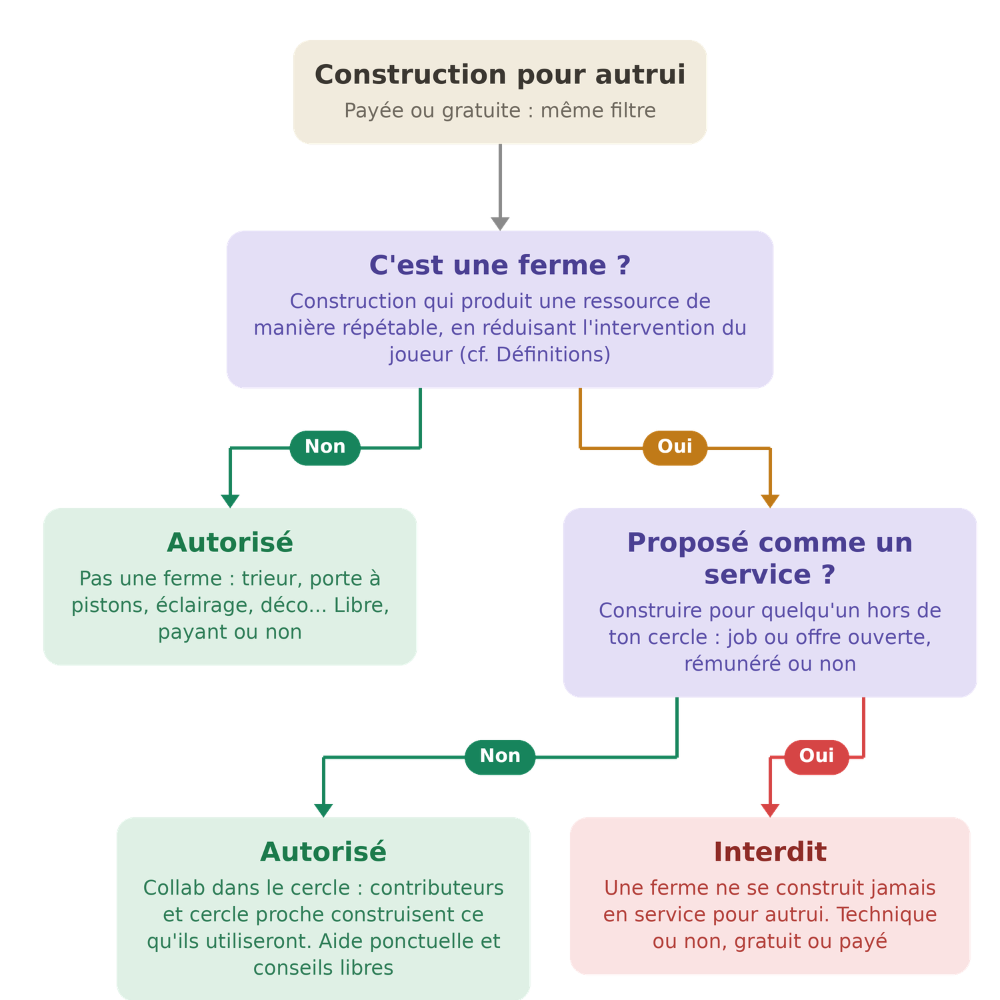

# 🚀 Règlement Général v3 (proposition)


**Page temporaire.** Deuxième itération de la refonte : architecture, numérotation et inventaire des règles repensés de zéro. À comparer au [Règlement Général](reglement.md) actuel et à la [v2](reglement-deux.md). Seul le règlement actuel fait foi. La table de correspondance est en bas de page.


En cas de doute, demande à la modération. En cas de litige, ouvre un ticket sur le [Discord](https://discord.gg/qqBCWgpRDc).

<h2 align="center"><mark style="color:yellow;">📖 Définitions</mark></h2>

Dans tout le règlement, ces termes ont le sens défini ici :

| Terme | Définition |
| --- | --- |
| **Ferme** | Construction conçue pour produire une ressource de manière répétable, en réduisant au maximum l'intervention du joueur. |
| **Cercle proche** | Personnes avec lesquelles tu entretiens une relation préexistante. Une relation nouée pour l'occasion (par exemple pour obtenir une construction) n'en fait pas partie. La modération l'apprécie sur des éléments antérieurs à la situation examinée : ancienneté des interactions, claims ou projets partagés, historique commun. |
| **Contributeur** | Joueur ayant réellement participé à la construction d'une ferme. Une participation symbolique ou arrangée pour l'occasion ne crée pas ce statut ; il s'apprécie sur les mêmes éléments antérieurs que le cercle proche. |
| **PW (warp joueur)** | Point de téléportation public créé par un joueur. |
| **Design technique public** | Plan de construction librement accessible (tutoriels, vidéos...), qu'aucun joueur ne peut revendiquer comme sa création. |

<h2 align="center"><mark style="color:yellow;">1. Principes généraux</mark></h2>

* **R1** · **Tu acceptes ce règlement en te connectant** à l'une des plateformes de Dynastia. L'<mark style="color:red;">Administration</mark> peut le modifier à tout moment. Un compte utilisé pour contourner une sanction s'expose à la même sanction.
* **R2** · **Ces règles s'appliquent sur toutes les plateformes de Dynastia** : serveur de jeu, Discord et tout autre canal officiel. Les règles qui n'ont de sens qu'en jeu (triche, PvP, biens, fermes, warps) ne concernent que le serveur.
* **R3** · **Une sanction est proportionnée** aux faits et aux antécédents du joueur, et ne vise que des faits interdits au moment où ils ont été commis. Le modérateur qui l'applique peut l'expliquer sur demande, sans obligation de divulguer les méthodes de détection.
* **R4** · **Tu peux contester une sanction** via un ticket sur le [Discord](https://discord.gg/qqBCWgpRDc) : la contestation est examinée par la modération, au besoin collégialement ou par l'administration.
* **R5** · **Nul membre de l'équipe ne traite un cas qui l'affecte personnellement** : le cas revient à un autre modérateur ou à l'administration.
* **R6** · **La modération est ton interlocuteur** pour toute question ; en cas de litige avec elle, l'administration est le dernier recours.
* **R7** · **Mentir à la modération**, dans un ticket ou lors d'un contrôle, est <mark style="color:red;">**interdit**</mark>.
* **R8** · **Aucun grade ne place au-dessus du règlement**, VIP ou staff : avantages de gameplay mis à part, mêmes règles et même modération pour tous. Les membres du staff jouent avec toi sans permission particulière sur le gameplay.

<h2 align="center"><mark style="color:yellow;">2. Ton compte</mark></h2>

* **R9** · **Ton compte est sous ton entière responsabilité**, sa sécurité comme ses actes : nous ne couvrons pas les piratages, ses infractions te suivent même commises par un tiers, et un bannissement n'est pas levé parce qu'un proche tenait le clavier. Ne communique jamais tes identifiants.
* **R10** · **Utiliser plusieurs comptes** sur le serveur est <mark style="color:red;">**interdit**</mark>, connectés simultanément ou non.
* **R11** · **Jouer avec un proche du même foyer** est <mark style="color:green;">**autorisé**</mark> à condition de prévenir la modération en amont.

<h2 align="center"><mark style="color:yellow;">3. Communication</mark></h2>

* **R12** · **La langue du serveur est le français.** Écris de manière compréhensible.
* **R13** · **Tout contenu portant atteinte à autrui ou inadapté à un public jeune** est <mark style="color:red;">**interdit**</mark> : sexuel, discriminatoire, haineux, violent, injurieux, notamment. La liste est illustrative : c'est le caractère du contenu qui constitue l'infraction.
* **R14** · **Les débats politiques et les querelles personnelles** sur les canaux publics sont <mark style="color:red;">**interdits**</mark>. Un désaccord ordinaire (négociation, débat de jeu...) n'est pas concerné tant qu'il reste courtois.
* **R15** · **Menacer une personne** (DDoS, incitation au suicide...) est <mark style="color:red;">**interdit**</mark>.
* **R16** · **Le spam et le flood** sont <mark style="color:red;">**interdits**</mark> : tout message dont le seul effet est de gêner les autres. Comptent notamment comme du spam : les majuscules rendant le chat illisible, et la publicité pour des PW au-delà d'un message par heure **par joueur**, tous PW confondus ; un même PW ne peut par ailleurs être annoncé qu'une fois par heure, tous annonceurs confondus.
* **R17** · **Divulguer une conversation privée** sans l'accord de tous ses participants est <mark style="color:red;">**interdit**</mark>, tout comme publier des informations privées.
* **R18** · **Les moyens de communication du serveur ne sont pas confidentiels** (chat, /msg, /mail...) : pour la sécurité des joueurs et le respect du règlement, ils peuvent faire l'objet de contrôles par l'équipe. Ce qui est consulté n'est jamais partagé en dehors du staff et du joueur concerné.
* **R19** · **Promouvoir un autre serveur ou une autre communauté** (Minecraft, Discord ou autre) est <mark style="color:red;">**interdit**</mark>, sous toute forme (lien, IP, nom, image...). Ne sont pas concernées : les annonces relatives à Dynastia (événements de joueurs, recrutements d'équipe...), et l'invitation personnelle de tes proches dans un groupe privé : inviter ses amis n'est pas de la promotion.

<h2 align="center"><mark style="color:yellow;">4. Identité et apparence</mark></h2>

* **R20** · **Se faire passer pour un autre**, joueur ou membre du staff, par pseudonyme, avatar ou comportement, est <mark style="color:red;">**interdit**</mark>.
* **R21** · **Skins, capes et pseudonymes suivent les critères de contenu des messages** (R13). Un compte en infraction est banni jusqu'au changement de l'élément concerné ; le débannissement se réclame une fois ce changement effectué.
* **R22** · **Les constructions suivent les mêmes critères.** Une construction en infraction fait l'objet d'une demande de modification sous délai ; à défaut, destruction par l'équipe et sanction.

<h2 align="center"><mark style="color:yellow;">5. Triche</mark></h2>

* **R23** · **Tout mod qui révèle des informations que le jeu cache, ou qui automatise des actions du joueur**, est <mark style="color:red;">**interdit**</mark> ; les mods de confort, purement visuels ou d'optimisation sont libres. Ce double critère fait foi pour tout mod, y compris hors liste ; en cas de doute, demande à la modération avant utilisation. Sont notamment <mark style="color:green;">**autorisés**</mark> :
  * les mods de carte, **sans visibilité sur les sous-sols et les minerais** ;
  * Litematica, **aide visuelle uniquement** ;
  * les mods de tri et de gestion d'inventaire, **tant qu'une action du joueur déclenche chaque opération** ;
  * les mods purement visuels ou d'optimisation (Optifine, Sodium...), **sans avantage de vision souterraine ou dans la lave**.
* **R24** · **L'autoclick est** <mark style="color:red;">**interdit**</mark> : tout mécanisme, logiciel ou matériel, générant des clics sans action manuelle. Maintenir un clic enfoncé via les mécanismes natifs du jeu n'est pas de l'autoclick ; reste néanmoins présent derrière ton écran et réponds à tout contrôle de la modération.
* **R25** · **Exploiter volontairement un bug** est <mark style="color:red;">**interdit**</mark>. Signale tout bug rencontré via un ticket sur le [Discord](https://discord.gg/qqBCWgpRDc).
* **R26** · **Dégrader volontairement les performances du serveur** est <mark style="color:red;">**interdit**</mark> : machines à lag, accumulations d'entités, systèmes conçus pour surcharger, qu'une mécanique de jeu soit détournée ou non.

<h2 align="center"><mark style="color:yellow;">6. Économie du jeu</mark></h2>

* **R27** · **Contourner les limites de vente de l'AdminShop** est <mark style="color:red;">**interdit**</mark>, notamment par échanges intermédiaires (ex. : échanger un shulker de citrouilles contre du bambou pour vendre au-delà de la limite). Dans toute vente entre joueurs, HDV compris, tes prix doivent être supérieurs au prix auquel l'AdminShop **achète** la ressource.
* **R28** · **Les pertes en jeu** ne sont compensées qu'en cas de bug imputable au serveur, via ticket ; dans tous les autres cas, la protection de tes biens t'incombe.

<h2 align="center"><mark style="color:yellow;">7. Boutique et transferts de compte</mark></h2>

* **R29** · **Échanger quoi que ce soit du serveur contre une contrepartie extérieure** est <mark style="color:red;">**interdit**</mark>, à la vente comme à l'achat : argent réel, monnaies ou biens d'autres plateformes, services hors serveur. Les articles de la boutique ne se vendent que sur la boutique officielle.
* **R30** · **Les achats en boutique sont définitifs** : aucun remboursement.
* **R31** · **Erreur de pseudonyme lors d'un achat ?** L'administration restaure l'achat sur le bon pseudonyme, contre preuve d'achat de moins de 48 heures.
* **R32** · **Mineur ?** L'autorisation de ton tuteur légal est requise avant tout achat.
* **R33** · **Transferts de compte** : l'administration peut migrer les données d'un compte vers un autre **uniquement si les deux appartiennent à la même personne**, dans les deux cas ci-dessous. Aucun transfert vers le compte d'une autre personne, même sur demande.
* **R34** · **Changement de pseudonyme** : le serveur conserve tout automatiquement, sauf les dollars ($), transférés par l'administration via un ticket précisant l'ancien et le nouveau pseudonyme.
* **R35** · **Compte perdu** : l'administration peut migrer vers ton nouveau compte, sur ticket, uniquement les éléments ci-dessous. Tout le reste est définitivement perdu.

| ✅ Transféré | ❌ Perdu |
| --- | --- |
| Inventaire et Ender Chest | Statistiques d'avancement vers le prestige suivant (kills, minage, crafts, objets...) |
| Dollars ($) | Crédits |
| Claims et les shops qu'ils contiennent | Votes et récompenses en attente |
| Niveau de prestige atteint et rang VIP | Tout élément hors de la colonne « Transféré » |
| Warps joueur | |

_Ce périmètre est une limitation technique : au-delà de cette liste, une migration fiable n'est pas réalisable sans risque pour le serveur._

<h2 align="center"><mark style="color:yellow;">8. Respect des joueurs et de leurs biens</mark></h2>

* **R36** · **Toute forme de PvP** est <mark style="color:red;">**interdite**</mark>, y compris tout moyen indirect d'infliger des dégâts (monstres, lave ou toute autre chose).
* **R37** · **Enfermer ou piéger un joueur contre son gré** est <mark style="color:red;">**interdit**</mark>, avec ou sans dégâts.
* **R38** · **Détruire ou dégrader la construction d'un autre joueur** est <mark style="color:red;">**interdit**</mark>, protégée ou non. Reconstruire peut atténuer la sanction, jamais l'annuler. Dynastia enregistre les actions des joueurs.
* **R39** · **Tuer, voler ou déplacer les entités apprivoisées ou détenues par un autre joueur** (animaux, villageois...) est <mark style="color:red;">**interdit**</mark>, en zone protégée ou non.
* **R40** · **Garder un objet perdu, jeté ou posé par un autre joueur** est <mark style="color:red;">**interdit**</mark> : si son propriétaire est connu, rends-le.
* **R41** · **Obtenir un bien, un paiement ou un service par tromperie** sur ce qui est promis en échange est <mark style="color:red;">**interdit**</mark> : ce qui est convenu s'honore. La modération tranche sur preuves.
* **R42** · **Copier, reproduire ou revendre une création originale** (build, map-art...), y compris en la capturant sous forme de schematic, sans l'accord préalable de son auteur est <mark style="color:red;">**interdit**</mark> ; garde une preuve de l'accord. Un design technique non public reste la création de son auteur. Les designs techniques publics (fermes, trieurs, systèmes issus de tutoriels) ne sont la création de personne : les reproduire est libre.
* **R43** · **L'EnderDragon appartient à ceux qui l'ont fait apparaître**, de son invocation à sa mort : contribuer au combat ou récolter les gains sans leur accord est <mark style="color:red;">**interdit**</mark>. Un dragon en vie que plus personne ne combat est libre.
* **R44** · **Construire ou définir une résidence dans ou près de la construction d'un autre joueur** sans son accord explicite préalable est <mark style="color:red;">**interdit**</mark> : les mondes sont vastes, installe-toi ailleurs. Garde une preuve de l'accord.

<h2 align="center"><mark style="color:yellow;">9. Fermes</mark></h2>

* **R45** · **Utiliser la ferme d'un autre joueur** est <mark style="color:red;">**interdit**</mark>, sauf si tu en es contributeur ou membre du cercle proche du propriétaire, **et** qu'il t'y a autorisé. Ces deux conditions sont cumulatives : hors contributeurs et cercle proche, l'accès est interdit même si le propriétaire veut l'accorder.
* **R46** · **Construire tout ou partie d'une ferme en service pour un autre joueur** est <mark style="color:red;">**interdit**</mark> : job ou offre ouverte, hors de ton cercle, gratuit ou payé, technique ou non.
* **R47** · **L'Administration peut détruire une ferme** qui nuit à l'expérience de jeu des autres, si son propriétaire refuse les modifications demandées.
* **R48** · **Louer une ferme ou vendre son accès** est <mark style="color:red;">**interdit**</mark>.

Le filtre de R46, en schéma :

* <mark style="color:green;">**Autorisé**</mark> : tout ce qui n'est pas une ferme (trieur, porte à pistons, éclairage, mini-jeu, décoration...), payant ou non.
* <mark style="color:red;">**Interdit**</mark> : une ferme construite en service pour autrui, rémunéré ou non, technique ou non.
* <mark style="color:green;">**Autorisé**</mark> : la collaboration au sein du cercle (contributeurs et cercle proche du propriétaire, le même cercle que R45), l'aide ponctuelle et les conseils.

<h2 align="center"><mark style="color:yellow;">10. Warps joueurs (PW)</mark></h2>

* **R49** · **Un PW doit se trouver à 10 chunks minimum de toute ferme, la tienne comprise**, pour qu'elle ne soit pas chargée par les visiteurs ; exception possible pour les fermes de taille modeste sans vocation de revente, à l'appréciation de la modération. En cas de conflit, l'antériorité prime : celui qui s'installe en second se met en conformité.
* **R50** · **Un PW doit être un point d'intérêt pour tous** : ne définis pas plusieurs PW autour d'une même zone quand un seul suffit, cela encombre la liste pour rien ; et ne t'en sers pas comme résidence supplémentaire. Les PW sans intérêt propre seront supprimés.

<h2 align="center"><mark style="color:yellow;">11. Têtes décoratives et objets légendaires</mark></h2>

* **R51** · **Le don de têtes décoratives (/hdb) ne doit pas se substituer à l'achat de la commande** : le commerce et les dons répétés vers un joueur n'y ayant pas accès sont <mark style="color:red;">**interdits**</mark> ; le don occasionnel, notamment à une équipe t'aidant sur une construction, est <mark style="color:green;">**toléré**</mark>. La modération apprécie au cas par cas selon ce principe.
* **R52** · **Louer un objet légendaire** (caisse légendaire) est <mark style="color:red;">**interdit**</mark> ; le vendre est <mark style="color:green;">**autorisé**</mark>.
* **R53** · **Le propriétaire d'un objet légendaire reste seul responsable** de sa casse ou de sa perte, même prêté gratuitement.

<mark style="color:red;">**► R54 · Contourner l'esprit du règlement, par quelque moyen que ce soit, est strictement interdit.**</mark>

***

## Notes de version (à retirer si adoption)

**Ce que la v3 change par rapport à la v2** : architecture redessinée (sections thématiques pleines), **numérotation plate R1 à R54** (l'identité d'une règle est découplée de sa position), purge des règles sans contenu opératoire et du boilerplate autoritaire, portée des règles enfin écrite (R2), résumé d'accueil supprimé. Les arbitrages de fond sont documentés sur la [page v2](reglement-deux.md).

**Convention d'entretien** (à conserver) : tant que le règlement n'est pas adopté, toute insertion se fait par renumérotation continue, un brouillon n'ayant pas de citations à protéger. À l'adoption, les numéros deviennent définitifs : une nouvelle règle s'insère alors sous un numéro suffixé de la règle qui la précède (après R8 : R8-2, puis R8-3...), une règle supprimée est marquée abrogée, et aucun numéro n'est jamais réutilisé ni renuméroté. Le numéro est une identité, pas une position.

**Fournée anti-failles du 05/08** (décisions de l'Administration) : non-rétroactivité intégrée à R3, nouvelles règles R5 (impartialité, escalade Administration), R7 (mensonge à la modération), R26 (machines à lag), R37 (piégeage de joueurs), R39 (entités d'autrui), R41 (arnaque, interdite : décision de principe) ; R29 étendu à toute contrepartie extérieure dans les deux sens ; R42 protège les designs techniques non publics ; R43 redéfini par dragon (invocation → mort, dragon abandonné libre) ; R44 étendu à toute construction près d'autrui ; R49 antériorité ; R16 double plafond de publicité PW (par joueur et par PW, exploits documentés par ZelouiX) ; « contributeur » défini au lexique (ferme le contournement par contribution symbolique). Rejetés en connaissance de cause : l'engagement de l'équipe par la réponse d'un modérateur (un modérateur peut se tromper et être contredit ; la bonne foi s'apprécie via R3), l'obligation d'annoncer chaque modification (risque d'oubli), la réglementation de l'abus de vote (plafonné techniquement, indétectable).

**Décisions de la passe de purge** (validées une à une) :

| Sujet | Décision |
| --- | --- |
| « Tu es seul responsable de ce que tu publies » (ex 3-10) | Abrogé : aucun contenu actionnable, boilerplate juridique inopérant |
| « Voler/revendre la création d'un autre » (ex 13-3) | Fusionné dans R42 avec mention explicite du schematic |
| Warp dans une ferme + distance (ex 15-6, 15-7) | Une seule règle de distance, R49 (« toute ferme, la tienne comprise ») |
| Anti-doublons de PW (ex 15-9) | R50 énonce l'intention en clair : pas plusieurs PW quand un seul suffit |
| « Exclure sans fournir de raison » (ex 0-1) | Supprimé : ne correspond à aucune pratique réelle, contredisait R3 |
| « Sans obligation de preuve » (ex 0-2) | Devient « sans obligation de divulguer les méthodes de détection » (R3) : même protection, zéro arbitraire |
| « Identifiés sans aucun doute possible » (ex 13-1) | Overclaim retiré : « Dynastia enregistre les actions des joueurs » suffit (R38) |
| Décharge mineurs (ex 11-6) | Retirée : inopérante en droit (protection des mineurs d'ordre public) ; l'obligation d'autorisation reste (R32) |
| « Les cadeaux restent possibles, leur revente non » (ex 11-7) | Retiré : seul l'argent réel est interdit ; la revente en jeu suit la nature de l'item |
| Menaces (R15) vs contenus (R13) | Chevauchement assumé : régimes différents (escalade réelle possible), deux règles |
| Accès aux fermes (ex 15-1, 15-2) | Conditions **cumulatives** en R45 : éligibilité (contributeur ou cercle proche) ET autorisation ; le propriétaire ne peut pas élargir |
| Annonces Dynastia (ex 2-2) | Devenue la borne de R19, plus une règle autonome |
| « L'essentiel en 10 réflexes » | Supprimé : dix paraphrases de normes qui désynchronisent à chaque édition (démontré dès la première) ; la lecture rapide est assurée par le format lui-même (titres, gras, verdicts colorés) |
| Schéma construction pour autrui (R46) | La question « technicité » disparaît (subjective, débat staff du 02/08) : une ferme ne se construit jamais en service pour autrui, technique ou non ; la collaboration dans le cercle reste libre. Philosophie retenue : on protège l'effort, pas le savoir |
| « Ferme lucrative » | Terme supprimé du lexique : indécidable par le joueur (liste AdminShop + chaînes de transformation) et distinction presque vide. Le critère devient « ferme » tout court ; la règle de chaîne n'a plus de raison d'être |
| R23, R24 | Précisés suite aux retours de Stalmi (04/08) : « non automatisés » défini (une action du joueur par opération), autoclick borné (clic maintenu natif autorisé, présence et réponse au contrôle obligatoires) |

**Table de correspondance** (ancien règlement → v3) :

| Ancien | v3 | Ancien | v3 |
| --- | --- | --- | --- |
| 0-1 | R1 | 11-2 | R30 |
| 0-2 | R3 | 11-3, 11-4 | R28 |
| 0-3 | R4 | 11-5 | R31 |
| 0-4, 0-6 | R6 | 11-6 | R32 |
| 0-5 | R8 | 11-7 | R29 |
| 1-1, 1-2, 1-3 (bis) | R9 | 11-8 | R33 |
| 1-3 | R10 | 11-9 | R34 |
| (foyer, non numéroté) | R11 | (compte perdu, nouveau) | R35 |
| 2-1, 2-2 | R19 | 13-1 | R38 |
| 3-1 | R12 | 13-2 | R40 |
| 3-2 | R13 | 13-3, 13-4 | R42 |
| 3-3 | R14 | 13-5 | R43 |
| 3-4 | R15 | 14 | R36 |
| 3-5, 3-6, 3-7 | R16 | 15-1, 15-2 | R45 |
| 3-8 | R8 | 15-3 | R46 |
| 3-9 | R17 | 15-4 | R47 |
| 3-10 | abrogée | 15-5 | R48 |
| (surveillance, nouveau) | R18 | 15-6, 15-7 | R49 |
| 4-1 | R20 | 15-8, 15-9 | R50 |
| 5-1 | R21 | 15-10 | R44 |
| 5-2 | R22 | 16-1, 16-1' | R51 |
| 6-1 | R23 | 16-2 | R52 |
| 6-2 | R24 | 16-3 | R53 |
| 6-3 | abrogée (doublon de 0-3) | 17 | R54 |
| 7-1 | R25 | | |
| 7-2 | R27 | | |
